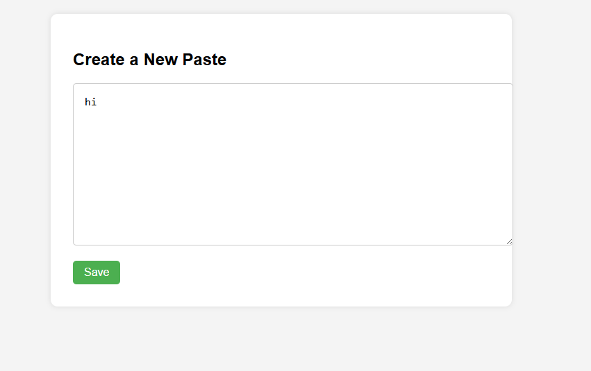
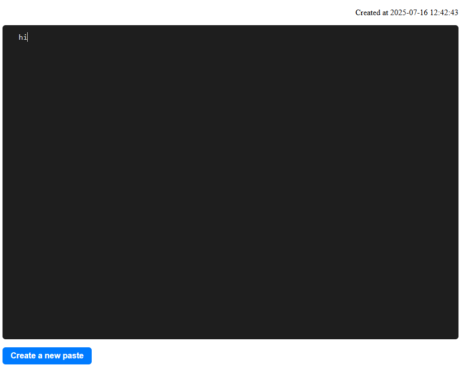

## SimpleBin

This is a really simple self-hostable paste bin site

I design this to be ultra simple, and lightweight. No logins, no bloated features, just straight to the point.

<p align="center">
  
</p>

<p align="center">
  
</p>

## Installation
Install requirements:
```sh
pip install -r requirements.txt
```

## Usage
Start `run.py`:
```sh
python3 run.py
```

The server will be exposed on `127.0.0.1:8000`
